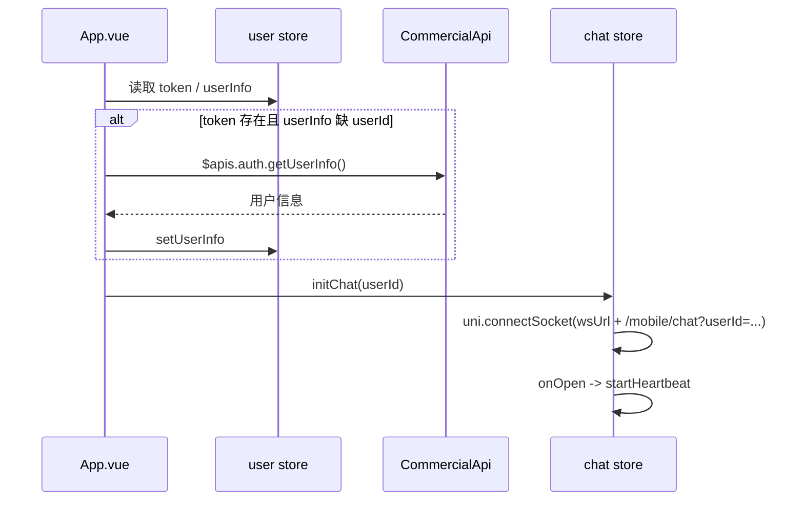
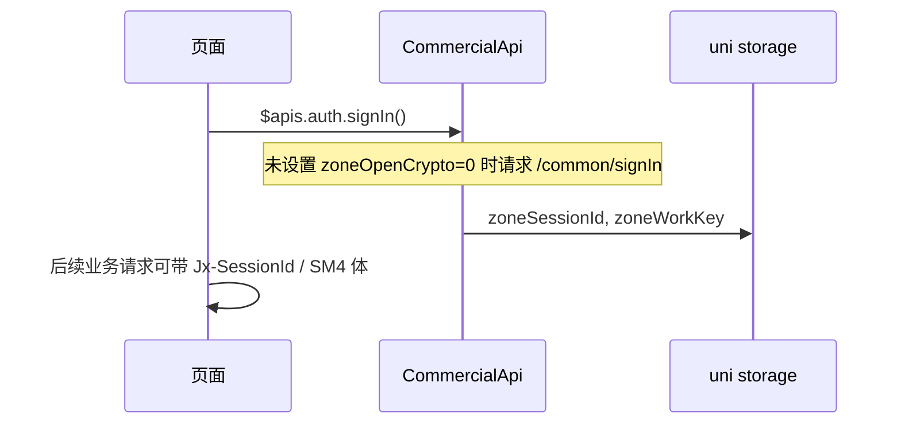

# 登录与即时通讯链路

本文说明客户端从 **用户鉴权**、**加密会话（可选）** 到 **WebSocket 长连接** 的协作关系，便于排查联调与线上问题。代码路径以仓库当前实现为准。

## 涉及模块

| 模块 | 路径 | 职责 |
|------|------|------|
| 用户态 | `stores/user.js` | `token`、`userInfo` 持久化；`logout` 时清空 `zoneSessionId` / `zoneWorkKey` |
| 聊天连接 | `stores/chat.js` | `uni.connectSocket`、心跳、`onMessage` 分发 |
| HTTP 封装 | `common/request/api.commercial.js` | RESTful、`Authorization`、可选国密、`signIn()` |
| 会话存储 | `common/request/session.js` | 读写 `zoneSessionId`、`zoneWorkKey`（与 `user` store 的 logout 同步清理） |
| 环境地址 | `common/request/config.js` | `baseUrl`、`wsUrl` 等 |
| 应用入口 | `App.vue` | 冷启动时根据 `userInfo` / `token` 拉用户信息并 `initChat` |

## 加密会话（`signIn`）说明

`$apis.auth.signIn()` 实际调用 `CommercialApi.signIn()`（见 `api.commercial.js`）：

- **`isCryptoEnabled()` 默认返回 true**；仅当本地存储 **`zoneOpenCrypto === '0'`** 时关闭加密。开启时会请求 **`POST /common/signIn`**，并用 **SM2** 解密响应，写入 **`zoneSessionId`**、**`zoneWorkKey`**。
- 关闭加密时，`signIn()` 直接 **`Promise.resolve()`**，不写会话密钥；开启加密请求体时，会用 **`sm4Key`** 作为兜底 workKey（见 `restful` 内注释）。

业务页在需要加密链路的场景会主动先 `signIn()`，例如：

- `pages/blog/index.vue`：进入博客前 `signIn` 再拉首页数据。
- `packageA/pages/my/login.vue`：登录流程中 `await` `signIn`。
- `pages/my/index.vue`：部分操作前链式调用 `signIn`。

## WebSocket 行为（`initChat`）

`useChatStore().initChat(userId)`（`stores/chat.js`）：

1. 无有效 `userId` 则直接返回，不建连。
2. 关闭已有 `socketTask`，避免重复连接。
3. 连接地址：**`wsUrl + '/mobile/chat?userId=' + userId`**（`wsUrl` 来自 `config.js`）。
4. `onOpen` 后启动 **心跳**：每 **10s** 发送 JSON：`{ cmd: 'heartbeat', content: 'heartbeat', senderId: userId }`。
5. `onMessage` 统一调用 **`emitMessage`**，由页面通过 **`registerMessageListener`** 订阅。

## 时序概览

下面的序列图描述「冷启动已有登录态」与「加密 signIn + 建连」的典型关系；除非设置 **`zoneOpenCrypto='0'`**，否则走加密分支。

登录页或博客页在 **开启加密** 时的补充关系：

## 退出与失效

- **`userStore.logout()`**（`stores/user.js`）：清空 `token`、`userInfo`，并 **`uni.setStorageSync('zoneSessionId','')`**、**`zoneWorkKey`**。
- **`complete()`**（`api.commercial.js`）：若响应 **`body.data?.reload`**，会调用 **`userStore.logout()`**，统一清登录态与加密会话。

WebSocket 侧若需随登出断开，应在业务里显式关闭 `socketTask`（当前 `logout` 未自动关闭连接，是否补充取决于产品需求）。

## 联调检查清单

1. **`config.js`**：`baseUrl`、`wsUrl` 与后端实际地址、是否 WSS 一致。
2. **加密联调**：未设置 **`zoneOpenCrypto='0'`** 时默认走加密；确认 `signIn` 是否成功写入 **`zoneSessionId`**。
3. **聊天**：`userInfo.userId` 是否存在；浏览器 / 小程序 **合法域名** 是否包含 WebSocket 域名。
4. **心跳**：10s 间隔是否与后端约定一致，避免被服务端断开。

---

[返回 Client README](../README.md)
